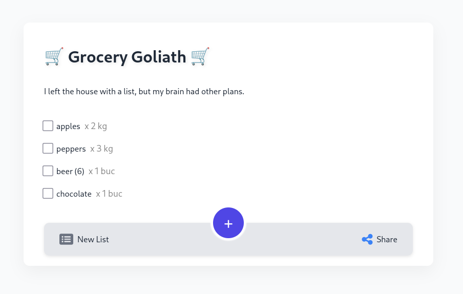

# ListLingo — *Talk Shop, Literally.*

**ListLingo** is a voice-powered shopping list assistant that transforms your spoken input into a structured, categorized list organized by grocery aisle — then lets you share it with friends. Powered by the Qwen3:30b-a3b LLM running on Ollama.




## 🛒 What It Does

Dictate a messy list like:

> "Need 2 liters of milk, a couple of avocados, about a kilo of rice, maybe oat milk, and chocolate for Oana."

And get back:

* Milk x 2l
* Oat Milk x 1
* Avocados x 2
* Rice x 1kg
* Chocolate (for Oana) x 1

All intelligently sorted and ready to check off, edit, or send to your shopping crew.

## ✨ Features

* 🎙️ **Voice-friendly natural language input**
* 🧠 **LLM-powered organization and sorting by aisle**
* 💾 **Persistent checklists with SQLite**
* 🐳 **Docker-ready deployment**

## 🚀 Getting Started

### Prerequisites

* Python 3.11+
* [Ollama](https://ollama.com) with `qwen3:30b-a3b` model
* SQLite (included)

### Installation

Clone the repo:

```bash
git clone https://github.com/smfloris/listlingo.git
cd listlingo
```

Install dependencies:

```bash
pip install -r requirements.txt
```

Start Ollama with the model:

```bash
ollama run qwen3:30b-a3b
```

### Run Locally

```bash
python app.py
```

Access the app at: [http://localhost:3030](http://localhost:3030)

### Run with Docker

```bash
docker build -t listlingo .
docker run -d \
  -p 3030:3030 \
  -e OLLAMA_URL="http://host.docker.internal:11434/api/generate" \
  -v $(pwd)/db:/app/db \
  --name listlingo \
  listlingo
```

## 🧱 Architecture

1. 🎙️ Voice input - with Android/iOs voice typing
2. 🤖 LLM parses, categorizes and sorts items
3. 💾 Data stored in SQLite
4. 🔁 API for reading/updating lists
5. 📤 Optional list sharing with friends

## 📄 License

MIT — see [LICENSE](LICENSE) for details.

## Motivation

Almost the whole thing was vibe-coded using [Aider.chat](https://aider.chat) with help from Qwen3 and [Ollama](https://ollama.com).
This was meant as an experiment to see how far the local models and tooling have come.
Code quality-wise, I'm not particularly impressed - but the whole thing works anyway. My own modifications were very minimal and only in one particalar case I HAD to intervene since the AI was going in circles.

Other than the quality of the code itself - the tooling was amazing. Aider is a great tool, Ollama is invaluable and Qwen3 proved to be good junior dev.

